# 🏥 Healthcare Analytics — Doctor Visits

### VOIS x TIRTC Project

Exploratory data analysis of a healthcare dataset to uncover patterns associated with doctor visits, including illness burden, reduced activity, age, gender, income, insurance coverage, chronic conditions, and general health.

## 📌 Problem Statement

The objective of this project is to analyze healthcare data and understand the factors associated with doctor visits. The analysis explores demographic, economic, insurance, health, and chronic-condition related variables to identify meaningful patterns in healthcare utilization.

## 📊 Dataset

The project uses a healthcare dataset focused on **doctor visits**.

The dataset contains information related to:

* Doctor visits
* Age
* Income
* Gender
* Illness
* Reduced activity days
* Health status
* Insurance type
* Chronic conditions

## 🔍 What I Did

* Cleaned and preprocessed the healthcare dataset
* Converted categorical variables into analysis-friendly formats
* Created age and income groups
* Analyzed doctor visits across different demographic groups
* Studied the relationship between illness and doctor visits
* Examined reduced activity days and healthcare utilization
* Compared doctor visits across insurance types
* Analyzed chronic health conditions
* Created correlation and feature-impact visualizations
* Explored the relationship between health score and doctor visits
* Analyzed age and insurance type together

## 📈 Analysis Covered

| Analysis                     | Visualization              |
| ---------------------------- | -------------------------- |
| Doctor Visit Distribution    | Target Distribution        |
| Gender vs Doctor Visits      | Bar Chart                  |
| Age vs Doctor Visits         | Age Group Analysis         |
| Income vs Doctor Visits      | Income Group Analysis      |
| Illness vs Doctor Visits     | Illness Burden             |
| Reduced Activity vs Visits   | Activity Analysis          |
| Insurance Type vs Visits     | Insurance Analysis         |
| Chronic Conditions vs Visits | Chronic Condition Analysis |
| Feature Relationships        | Correlation Heatmap        |
| Feature Impact               | Impact Visualization       |
| Health vs Visits             | Health Score Analysis      |
| Age × Insurance              | Heatmap                    |

## 💡 Key Findings

The analysis highlights how doctor visits vary with:

* Illness burden
* Reduced activity
* Age
* Income
* Insurance coverage
* Chronic conditions
* General health status
* Gender

These visualizations provide an overview of the factors associated with healthcare utilization in the dataset.

## 📷 Sample Outputs

### Target Distribution

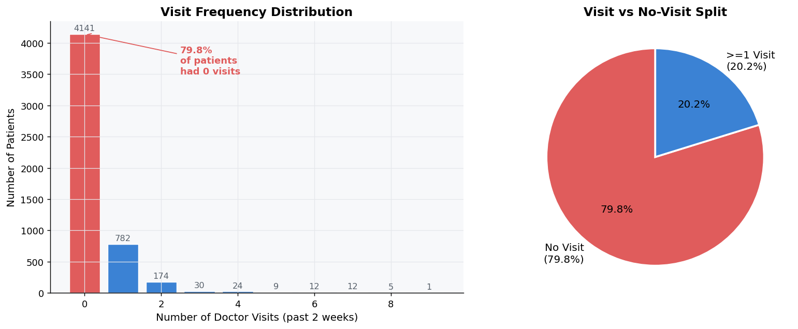

### Gender & Visits

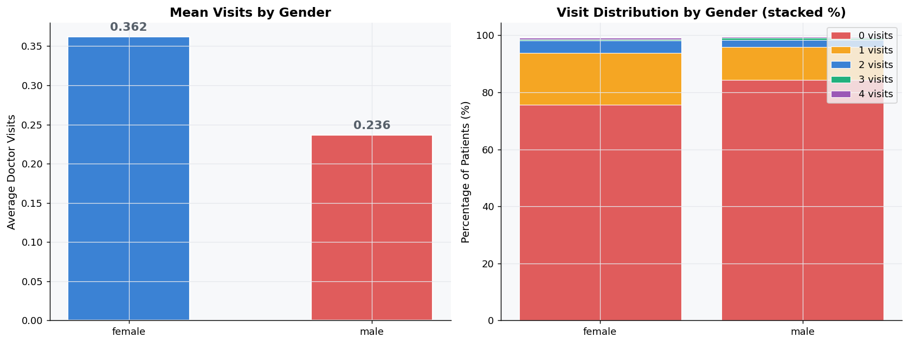

### Age & Visits

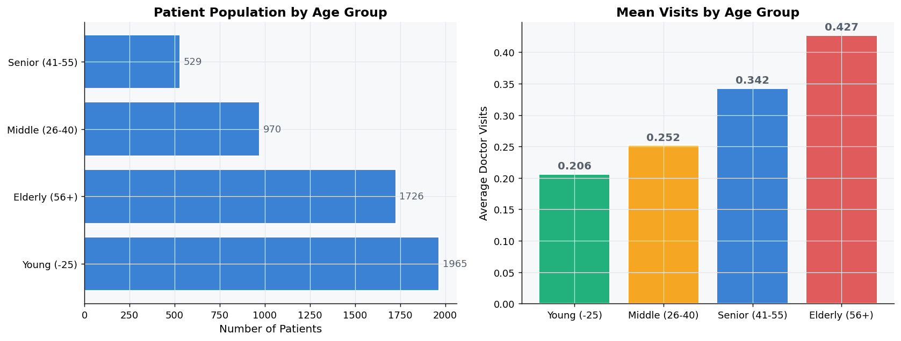

### Income & Visits

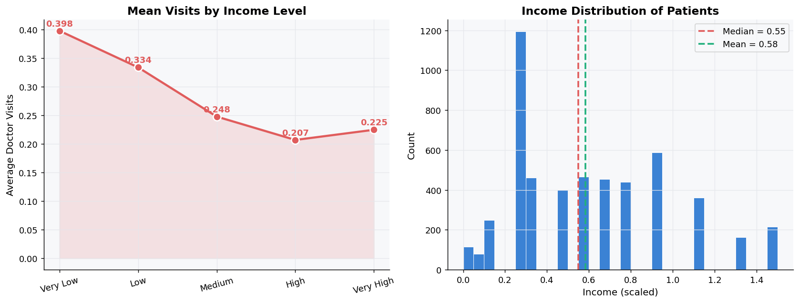

### Illness & Visits

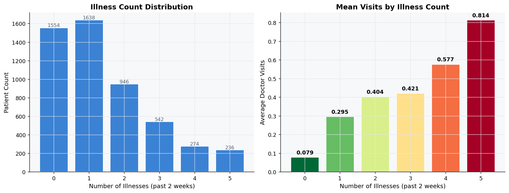

### Reduced Activity & Visits

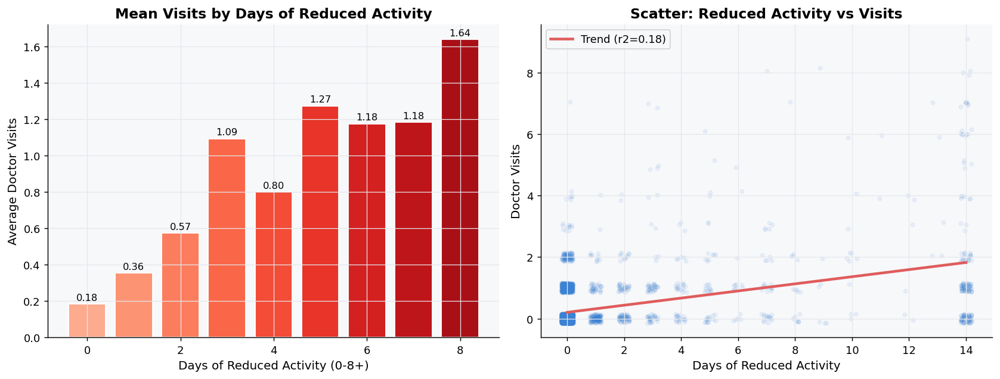

### Insurance & Visits

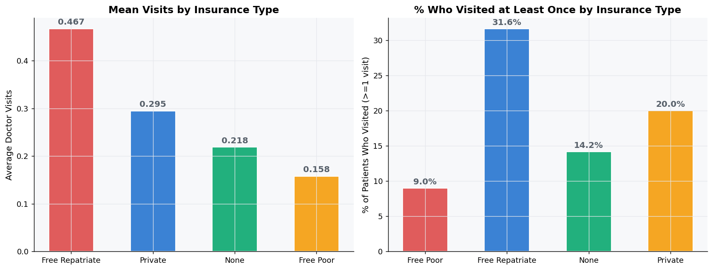

### Chronic Conditions & Visits

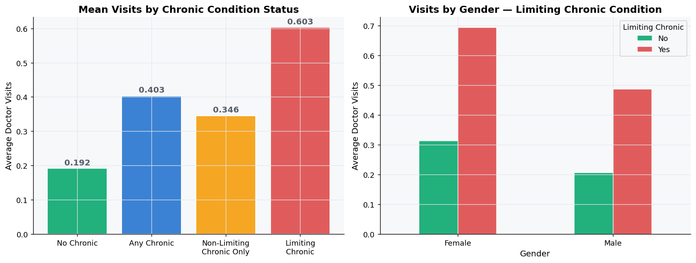

### Correlation Heatmap

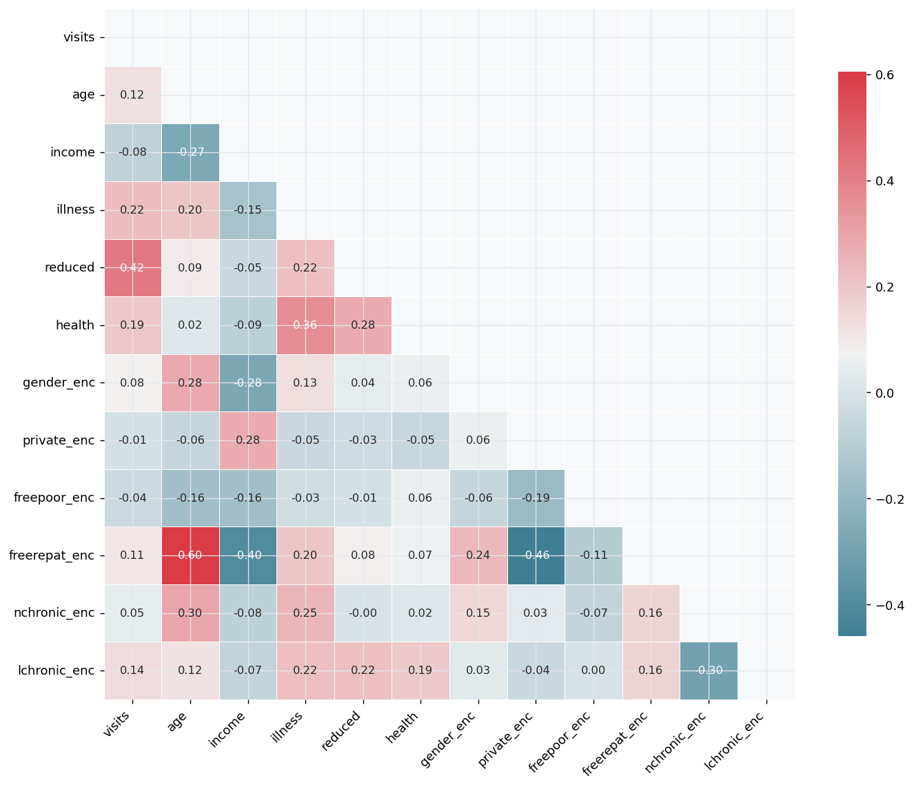

### Feature Impact

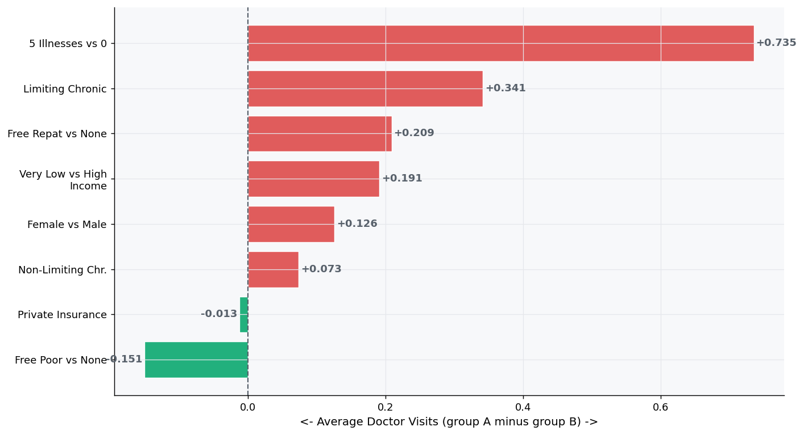

### Health & Visits

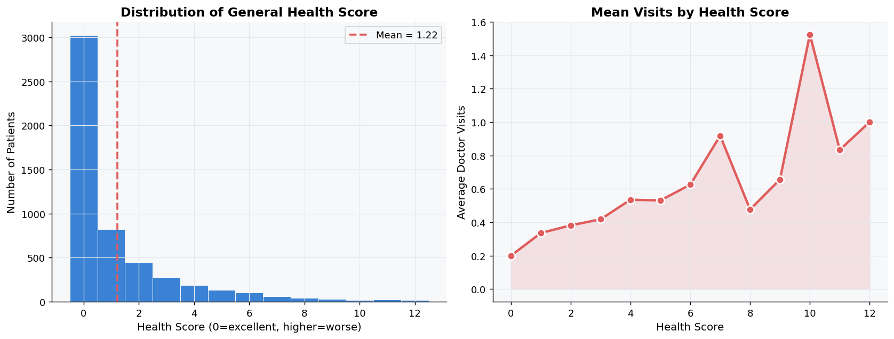

### Age × Insurance Heatmap

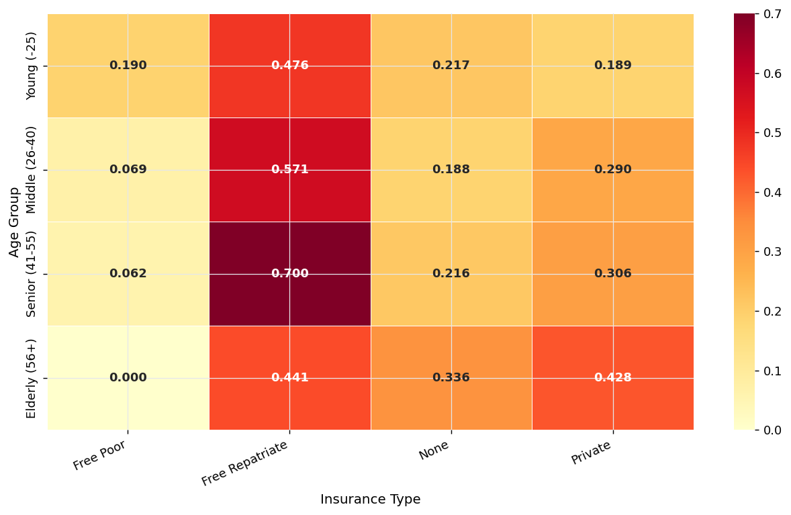

## 🛠️ Tech Stack

* Python
* Pandas
* NumPy
* Matplotlib
* Seaborn
* Streamlit

## ▶️ How to Run

1. Clone the repository.
2. Keep the Python code file and CSV dataset in the project folder.
3. Install the required libraries:

```bash
pip install pandas numpy matplotlib seaborn streamlit
```

4. Run the Streamlit dashboard:

```bash
streamlit run Samistha_Healthcareanalyticsdoctorvisitdiyproject.py
```

## 📁 Repository Structure

```text
Healthcare-Analytics-Doctor-Visits/
│
├── Samistha_Healthcareanalyticsdoctorvisitdiyproject.py
├── 1776250375-P2-Healthcare Analytics for Doctor Visits.csv
├── README.md
│
└── plots/
    ├── 01_target_distribution.png
    ├── 02_gender_visits.png
    ├── 03_age_visits.png
    ├── 04_income_visits.png
    ├── 05_illness_visits.png
    ├── 06_reduced_visits.png
    ├── 07_insurance_visits.png
    ├── 08_chronic_visits.png
    ├── 09_correlation_heatmap.png
    ├── 10_feature_impact.png
    ├── 11_health_visits.png
    └── 12_age_insurance_heatmap.png
```

## 👩‍💻 Project

**VOIS x TIRTC Project**

Healthcare Analytics — Doctor Visits

## Author
**Samistha Kesarwani**
Btech Student
